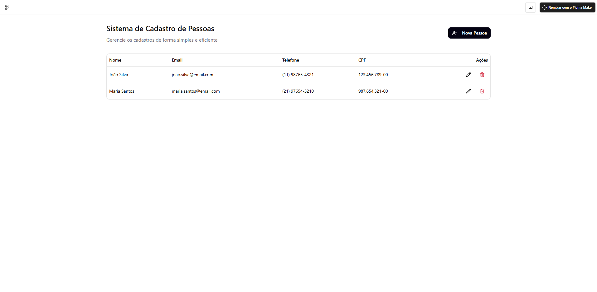

# 🧩 EasyPeople

Projeto criado para aula de Programação Orientada a Objetos(POO) usando SpringBoot e Thymeleaf

## 🎨 Protótipo no Figma

Abaixo está uma prévia do protótipo desenvolvido no Figma:

  

👉 [Acesse o protótipo completo no Figma](<https://flash-waltz-49716214.figma.site/>)  

---

## 🚀 Tecnologias Utilizadas

- Figma (para design e prototipagem)
- Thymeleaf (Front-End)
- Java (Back-End)
- SpringBoot (Framework)

---

## 💡 Como visualizar

1. Execute o comando `mvn spring-boot:run` dentro da pasta do projeto;
2. Acesse `localhost:8080`

---

## 👨‍💻 Autor

**Vitor Albano**  
📧 <vitor-albano@hotmail.com>  
🔗 [LinkedIn](<https://www.linkedin.com/in/vitoraalbano>)
